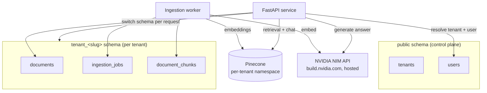
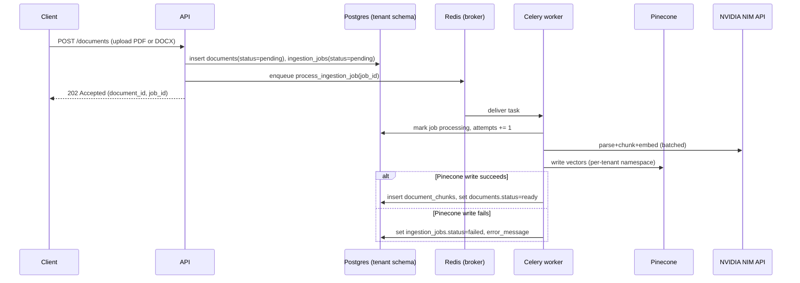

# DocQA SaaS — Architecture

*Suggested project name: `docqa-saas`. Rename freely — this doc doesn't depend on it.*

## Summary

A B2B multi-tenant SaaS backend that lets an organization's users upload
documents (PDF and DOCX) and ask questions about them through a RAG-based
chatbot, with every answer grounded in citations back to the source document
and page. Built to prove backend engineering fitness: correct multi-tenant
data isolation, a real async ingestion pipeline, and a LangChain-orchestrated
RAG chain — not just a working demo.

Two decisions in this design are deliberately the *harder* option rather
than the simplest one, because demonstrating the harder pattern well is the
point of the project: **schema-per-tenant** isolation (not shared-schema)
and using the **NVIDIA API Catalog (build.nvidia.com / NIM)** for chat and
embeddings — a free, hosted API rather than a self-hosted local model.
Both are called out explicitly below, including what they cost.

## Non-goals

- A full RBAC/ABAC permission system. Users get a simple `admin` / `member`
  role per tenant — fine-grained permission modeling is already covered by
  the separate `rbac-boilerplate` / `abac-boilerplate` projects and isn't
  what this project is meant to demonstrate.
- Horizontal scaling, multi-region deployment, or high-availability Postgres.
- Billing/subscription management.
- Streaming chat responses (SSE/websocket) — v1 chat is request/response.
- Email-based team invites. An admin can add a teammate directly
  (`POST /team/members`), setting their initial password themselves and
  sharing it out of band — there's no invite-email flow.

## Core workflows

1. **Tenant + admin signup.** A new organization signs up: a `tenants` row
   is created, a dedicated Postgres schema is provisioned and migrated, and
   the first `admin` user is created for that tenant.
2. **Login.** A user submits email + password. The backend resolves which
   tenant that email belongs to, verifies the password, and issues a JWT
   carrying `user_id` + `tenant_id`. Every subsequent request derives tenant
   context from this token — never from client input.
3. **Document upload.** An authenticated user uploads a PDF or DOCX file
   (sniffed from actual file content, never trusted from the client's
   filename or Content-Type). The file is stored, a `documents` row is
   created in *that tenant's* schema with `status=pending`, and an ingestion
   job is queued. The request returns immediately with a job/document id.
4. **Background ingestion.** A worker picks up the job: extracts text —
   per page for PDF (`pypdf`), or as a single page for DOCX (`python-docx`;
   DOCX has no page-boundary information in the saved file, so citations on
   a DOCX document always say "page 1" — see Key Decisions) — chunks it,
   generates embeddings (NVIDIA NIM embedding endpoint, batched per
   request), writes vectors to that tenant's Pinecone namespace, records
   chunk metadata in Postgres, and flips `documents.status` to `ready` (or
   `failed` with an error).
5. **Chat Q&A.** A user asks a question. The backend embeds the query,
   retrieves the top-matching chunks from *that tenant's* Pinecone namespace
   only, builds a grounded prompt via LangChain, calls the local LLM, and
   returns an answer with citations (document name + page number) resolved
   from the retrieved chunks' Postgres metadata. Passing a prior response's
   `conversation_id` continues that conversation — the caller's own recent
   turns are replayed to the model as context, and the turn is persisted
   (`conversations`/`messages`), visible only to the user who asked it.
6. **Session management.** Login returns an access token plus a
   single-use, rotating refresh token; reusing an already-rotated refresh
   token is treated as a possible theft signal and revokes every session
   for that user. See Key Decisions and `services/session.py`.
7. **Frontend.** A Next.js app (see `frontend/README.md`) is the only
   client today — it never talks to the FastAPI backend directly from the
   browser, only through its own Route Handlers (a BFF), which is also
   where the session tokens actually live (httpOnly cookies).

## Components

- **Control-plane data (Postgres, `public` schema).** Holds `tenants` and
  `users`. This is the one part of the system every tenant's login has to
  reach *before* tenant context exists — see the Key Decisions note on why
  users live here and not inside each tenant's isolated schema.
- **API service (FastAPI).** One service, all endpoints. A request-scoped
  dependency resolves the tenant from the JWT and binds the DB session to
  that tenant's Postgres schema for the rest of the request — this is the
  single chokepoint that must never trust a client-supplied tenant id.
- **Per-tenant business data (Postgres, one schema per tenant).** Holds
  `documents`, `ingestion_jobs`, `document_chunks`. Created and migrated
  when a tenant is provisioned.
- **Ingestion worker.** A Celery worker process, backed by Redis as the
  broker. Dispatch is event-driven, not polled: uploading a document
  enqueues one task for that job immediately (see `document_upload.py`),
  which runs the parse → chunk → embed pipeline via LangChain and writes
  results. A crashed task gets redelivered to another worker automatically
  (`task_acks_late` + `task_reject_on_worker_lost`); `reclaim_stuck_jobs`
  is a defensive backstop run once at worker startup for the rarer case
  where the broker itself lost track of a task. See Key Decisions below —
  this replaced an original single-process DB-polling design.
- **Vector store (Pinecone).** One namespace per tenant, within a single
  shared serverless index, so the vector-store boundary mirrors the
  Postgres isolation boundary instead of running against it — this is
  Pinecone's own documented multi-tenancy pattern, not a bespoke one.
  Managed/hosted, so unlike the earlier ChromaDB plan there's no
  self-hosted vector-store container in this deployment.
- **LLM/embedding runtime (NVIDIA NIM API, build.nvidia.com).** Hosted chat
  model and a retrieval-tuned embedding model, both called through
  LangChain's `langchain-nvidia-ai-endpoints` integration (`ChatNVIDIA` +
  `NVIDIAEmbeddings`) via an API key. No local GPU or model hosting needed —
  see the Key Decisions note below for why this replaced local Ollama.
- **Frontend (Next.js, `frontend/`).** A single client app, built after the
  backend was fully proven. It never calls FastAPI directly from the
  browser — every request goes through the app's own Route Handlers
  (`frontend/app/api/*`), which act as a BFF: they hold the access/refresh
  tokens in httpOnly cookies (never exposed to browser JS), attach the
  bearer token to the real backend call, and transparently retry once
  through `/auth/refresh` on a 401. This also means the backend needs no
  CORS configuration — the browser only ever talks to the Next.js origin.
  See `frontend/README.md` for the full design.

### State ownership

| Data | Owner | Everyone else |
|---|---|---|
| Tenant registry, user directory + credentials | `public` schema | API resolves tenant/user by querying here; nothing else writes it |
| Document metadata, ingestion job status, chunk-to-page mapping | The owning tenant's schema | Pinecone never claims ownership of this — see below |
| Vector embeddings | Pinecone, per-tenant namespace | Derived data only. Postgres `documents.status` is the source of truth for "does this document exist and is it usable" — Pinecone is not queried to answer that |

## Data model

**`public` schema (control plane):**
- `tenants(id, name, schema_name, status, created_at)`
- `users(id, tenant_id FK, email UNIQUE, hashed_password, role, created_at)`
- `refresh_tokens(id, user_id FK, token_hash UNIQUE, created_at, expires_at, revoked_at, replaced_by_id)` —
  session management; see Key Decisions and services/session.py.

**Per-tenant schema (`tenant_<slug>`):**
- `documents(id, filename, doc_type, uploaded_by_user_id, status, page_count, storage_path, uploaded_at)`
- `ingestion_jobs(id, document_id FK, status, attempts, error_message, created_at, updated_at)`
- `document_chunks(id, document_id FK, chunk_index, page_number, chunk_text, pinecone_vector_id)`
- `conversations(id, user_id, created_at, updated_at)` — private to the
  user who started it, not shared tenant-wide like documents.
- `messages(id, conversation_id FK, role, content, citations JSONB, created_at)` —
  `citations` is only populated on `assistant` rows, same shape `POST /chat`
  returns.

`document_chunks` is the deliberate bridge table: it's what lets a citation
be rendered (document + page) without round-tripping to Pinecone, and it's
the Postgres-side record that makes the vector in Pinecone traceable back
to something real.

For a DOCX document specifically, `page_number` is always `1` on every
chunk and `documents.page_count` is always `1` — an honest simplification,
not a fabricated precision. See Key Decisions.

## Key Decisions

| Decision | Alternatives | Choice | Why |
|---|---|---|---|
| Tenant isolation | Shared schema + `tenant_id` column; schema-per-tenant; database-per-tenant | **Schema-per-tenant** | Deliberately the heavier pattern — proving you can build and reason about real per-tenant isolation (dynamic schema provisioning, per-request schema binding, per-schema migrations) is more valuable here than the cheaper shared-schema default. Cost accepted: tenant provisioning is now a multi-step operation (see Reliability below), and every DB session must be explicitly bound to the right schema. |
| User/auth data placement | Duplicate user record in each tenant schema; keep users only in `public` | **`public` schema, tagged with `tenant_id`** | Login has to resolve *which* tenant a user belongs to before any tenant schema can be selected — there's no way to query a schema you don't know yet. Duplicating user rows per-tenant would create two independently-writable copies of the same fact (a real "which one is true" bug waiting to happen). So auth identity is control-plane data; only *business* data (documents, chat) gets tenant-schema isolation. |
| LLM + embeddings | OpenAI (paid, no ongoing free tier); Anthropic Claude (paid, no native embeddings API — would need a second provider); local via Ollama (free, but self-hosting an inference server becomes real ops burden once actually deployed); NVIDIA API Catalog (build.nvidia.com / NIM) | **NVIDIA API Catalog (NIM), hosted** | Free tier (rate-limited, no ongoing per-token cost) *and* hosted — satisfies "free and reliable" better than the alternatives, and removes the self-hosting/GPU-provisioning burden Ollama would have added once this is actually deployed. Ships both chat models (Llama, Nemotron, Mixtral, etc.) and retrieval-tuned embedding models (the `nv-embedqa` family) from one provider, with a first-class LangChain integration (`langchain-nvidia-ai-endpoints`). Cost accepted: a real external network dependency (latency, rate limits, occasional outages) where local inference had none — see Reliability below. Free-tier limits (observed ~40 requests/minute per key, historically credit-based) come from third-party trackers, not NVIDIA's own docs directly — confirm current terms when the account is created, since these move. *(Supersedes the earlier "local Ollama" choice — implementation hadn't started, so this is a plan revision, not a rebuild.)* |
| Vector store | ChromaDB (original choice, superseded); pgvector inside Postgres; Pinecone | **Pinecone** | Switched from the original ChromaDB choice per team decision, before any vector-store code existed. Pinecone's managed, serverless model removes self-hosted vector-DB operations from the deployment surface entirely, at the cost of a second external paid dependency (alongside NVIDIA NIM) and a second API key to manage. Tenant isolation maps to Pinecone's own documented multi-tenancy pattern: one namespace per tenant inside a single shared index, rather than one Chroma collection per tenant. |
| Document ingestion | Synchronous inline processing; async background job | **Async, event-driven job queue (Celery + Redis)** | Local embedding inference is slow enough that a synchronous upload endpoint would risk timing out on any real PDF. Originally a DB-polling loop (a `ingestion_jobs` table + in-process poller, judged sufficient before ingestion concurrency was actually needed) — migrated to Celery once near-instant pickup and real parallel processing across jobs/tenants became the actual requirement, not a hypothetical one. `ingestion_jobs.status`/`attempts`/`error_message` in Postgres stay the source of truth for job state either way; Celery only changed *how* a job gets picked up and retried, not what the API surfaces about it. |
| Frontend | Build now (React SPA); build now (server-rendered); defer | **Defer, decide later** *(superseded — see below)* | User's stated priority is backend correctness first, but a real frontend is a concretely planned next phase (not speculative — deployment is intended). Captured under Not Now with a real revisit condition, not left vague. |
| Frontend framework, once built | Plain React + Vite SPA (simplest, tokens in `localStorage`); Next.js App Router | **Next.js App Router**, with its Route Handlers used as a BFF | Chosen for both technical merit and job-market relevance (explicit project goal — this is a portfolio piece). The BFF pattern is the real reason, not just the resume line: Route Handlers proxy every backend call and hold both tokens in httpOnly cookies, so browser JS never sees a raw token — a genuine security improvement a plain SPA can't get without its own backend. It also means the backend needs zero CORS configuration, since the browser only ever talks to the Next.js origin. |
| Team members | No invite flow (deferred to future); add an admin-only "create user in my tenant" endpoint now | **Added `POST /team/members`, admin-only** | Signup only ever creates one admin user per tenant — nothing else let that admin add a second user, even though `role` was already modeled. Scoping the frontend to single-user tenants was the cheaper option but would have made "Team" page design vacuous; the endpoint is a small, isolated addition (same shape as `provision_tenant`'s user-creation half) rather than a redesign. |
| DOCX page numbering | Compute real page boundaries at ingestion time (e.g. render/paginate the document server-side); treat the whole document as one page | **Whole document is page 1** | DOCX doesn't store page boundaries in its saved XML at all — pagination is purely a rendering-time concern of whatever program (Word, LibreOffice, a print driver) lays the text out, and that layout depends on page size, margins, and fonts that aren't fixed at save time. Actually computing pages would mean embedding a rendering engine (a real dependency and a slow one) just to produce a number that could still disagree with what the user sees in their own copy of the file. Cost accepted: every citation on a DOCX document reads "page 1," a real (if minor) UX regression versus PDF citations — stated here and in the ingestion code rather than hidden behind a fabricated page count. |

## Reliability, concurrency & trust concerns

**Tenant provisioning is multi-step and must not leave a half-created
tenant.** Creating a tenant means: insert the `tenants` row, `CREATE SCHEMA`,
run migrations against it, create the admin user. If migration fails after
the schema exists, the tenant is broken but present. Track this with
`tenants.status` (`provisioning` → `active` / `failed`) so a failed
provisioning is visible and retryable, rather than silently half-done.

**Ingestion must be idempotent under retry.** If the worker crashes
mid-job and retries, it must not double-write chunks or leave orphaned
vectors. Use `ingestion_jobs.status` transitions (`pending` → `processing`
→ `done`/`failed`) and clear any partial `document_chunks` rows for that
document before re-running, rather than appending on top of a partial
attempt.

**Ingestion writes to two datastores — order matters on partial failure.**
A single ingestion job writes both to Pinecone (vectors) and Postgres
(`document_chunks`, `documents.status`). Write Pinecone first, Postgres
second, and treat the Postgres write as the commit point: if Postgres fails
after Pinecone succeeded, you're left with orphaned-but-harmless vectors
(nothing references them yet, and a retry regenerates cleanly). Doing it
the other way around — Postgres first — would let a client see
`status=ready` and `document_chunks` rows pointing at vectors that were
never actually written to Pinecone, which is a worse failure to be in.

**Tenant context is never trusted from the client.** This is the single
security invariant the whole system rests on: `tenant_id` is derived only
from the verified JWT, server-side, once per request — never from a
request body, query param, or header the client controls. Every query
after that point runs against the schema resolved from that token.

**The NVIDIA NIM API and Pinecone are both external dependencies now, not a
local process.** Unlike the earlier local-Ollama and local-Chroma plans,
every chat call, embedding call, and vector write/query is now a network
call to a third party that can be slow, rate-limited, or briefly down.
Chat requests need a request-level timeout with a clean error response
(not a hang). Ingestion jobs should retry on transient failures (bounded
attempts, backoff) and land in `failed` with a visible `error_message` on a
hard failure — never silently dropped. Specifically for NIM's free-tier
request-per-minute ceiling: batch chunk embeddings into as few API calls as
possible during ingestion (most embedding endpoints accept a list of texts
per request) rather than one call per chunk, and treat a 429 (rate
limited) as retryable, not a hard failure. This ceiling matters more now
that ingestion actually runs with real concurrency (the Celery worker's
default prefork pool) rather than one job at a time sequentially —
`config.ingestion_rate_limit` (Celery's per-task `rate_limit`, `"40/m"` by
default) caps the worker's own aggregate NVIDIA call rate declaratively,
rather than that ceiling being an implicit side-effect of single-worker
sequencing the way it used to be. Pinecone's own request limits
and transient-error behavior need the same bounded-retry treatment once
its client is actually integrated — not yet confirmed against Pinecone's
current published limits.

**Observability.** Structured logs on ingestion job transitions and chat
requests, tagged with `tenant_id` and `document_id`/`job_id`, are enough to
debug the failure modes above without a metrics stack.

**Chat retrieval uses a relevance threshold, not "always answer from top-k."**
Pinecone matches below `chat_score_threshold` (cosine similarity) are
dropped before they ever reach the prompt or the response — the LLM never
sees a barely-related chunk, and the client never gets a citation to one.
This is what keeps an unrelated question from returning a fabricated
citation: retrieval always returns *some* nearest vectors, but "nearest"
isn't the same as "relevant," so relevance has to be filtered explicitly
rather than trusted from top-k alone. When nothing clears the threshold,
the endpoint returns a canned "not enough information" answer without
calling the chat model at all.

**The threshold value was tuned from a real false negative, not picked
arbitrarily.** A real (non-mocked) Docker E2E run on 2026-08-29 found a
single-chunk test document containing both "employees may expense up to
$75 per day for meals" and "receipts are required for any expense over
$25." The direct question "How much can I expense per day for meals?"
scored 0.465 against that chunk (correctly retrieved, threshold was 0.3).
The clearly-answerable follow-up "And when do I need a receipt?" scored
only 0.197 against the *same* chunk — below 0.3 — so the endpoint
incorrectly answered "I don't have enough information," even though the
answer was right there. Short, pronoun/paraphrase-heavy follow-ups
embed much further from the chunk they're actually answered by than
direct, keyword-overlapping questions do, at least for the embedding
model in use (`nvidia/llama-nemotron-embed-vl-1b-v2`).

A follow-up experiment (33 real embedding calls against three synthetic
HR-policy chunks) measured three classes of question:
- **Obviously unrelated** ("What is the capital of France?"): scored
  roughly `[-0.04, 0.04]` against every chunk.
- **Genuinely relevant** (direct questions and paraphrased follow-ups
  actually answered by a chunk): scored `>= 0.257`, with direct
  keyword-overlapping phrasings scoring much higher (up to 0.57) than
  pronoun-style follow-ups.
- **Same-domain but genuinely unanswerable** (e.g. "What's the dress
  code policy?" against a chunk that only covers expenses — the harder
  negative class, since it's topically close but not actually
  answerable): scored `~0.10-0.22`, overlapping the low end of the
  relevant band.

Conclusions drawn from this:
1. **The threshold was lowered from 0.3 to 0.2.** This keeps a >6x
   margin below every observed relevant score while staying far above
   the obviously-unrelated band, fixing the false-negative class of bug
   above without materially weakening the original anti-fabrication
   guarantee — a completely unrelated question still cannot clear 0.2.
2. **No absolute cutoff cleanly separates "relevant paraphrase" from
   "adjacent but unanswerable" for this model on short queries** — the
   two bands genuinely overlap (relevant as low as 0.197 observed live;
   adjacent-unanswerable as high as 0.22 observed in the experiment).
   0.2 is a defensible operating point given the evidence, not a value
   that eliminates the gray zone. A same-domain-adjacent question can
   still occasionally clear it and surface a citation to a chunk that
   doesn't actually answer it — the system prompt's "answer using ONLY
   these sources, otherwise say you don't have enough information" is
   the remaining backstop against that turning into a fabricated
   *answer* (though the citation itself could still look confusing next
   to that canned reply — a known limitation, not fixed here).
3. **`chat_top_k` was left unchanged.** The reported failure was never a
   "correct chunk didn't make it into the candidate pool" problem — the
   correct chunk *was* returned by Pinecone every time, at every top_k;
   it was excluded by the score filter afterward. Raising top_k widens
   the candidate pool but doesn't change any individual match's score,
   so it wouldn't have fixed this failure mode.
4. **A relative/best-match-relative threshold was considered and
   rejected.** That approach only helps decide how many matches *beyond
   the top one* to keep — it has nothing to say about whether the top
   match itself is good enough, which is exactly where this bug lived
   (a single-chunk document, so the correct chunk was always both the
   best and only candidate). A relative threshold would not have
   changed the outcome for the reported case.
5. **The real fix for follow-up-question recall is query rewriting**
   (embedding a history-aware reformulation of the question instead of
   the raw text — see `chat_history_turns` above, which currently only
   replays history to the *generation* model, not to retrieval). That's
   a bigger change than a threshold tune and is tracked as future work,
   not implemented here.

## Deployment

Single-host Docker Compose: `postgres`, `redis` (Celery's broker), a
one-shot `migrate` service (`alembic upgrade head` against the `public`
schema, then exits — tenant schemas are provisioned separately at signup,
not Alembic-managed), and `api`/`worker`, both built from the same
`Dockerfile` and differing only in `command:` (`worker` runs
`celery -A docqa.celery_app worker --loglevel=info`). `api`/`worker` wait
on `migrate` finishing successfully and `redis` being healthy before
starting. No local LLM/embedding container and no self-hosted vector-store
container needed — both the NVIDIA NIM API and Pinecone are called over the
network, which also means deployment doesn't need a GPU-capable host and
doesn't need to operate a vector database. The NVIDIA API key and the
Pinecone API key are both secrets, injected via environment variables
(`env_file: .env`), never committed to the repo. `DATABASE_URL`/`REDIS_URL`
are overridden per-service in `docker-compose.yml` to point at the
`postgres`/`redis` service hostnames rather than `.env`'s `localhost`
values, since containers and a host process reach these over different
networks. Verified end-to-end on 2026-08-31: `docker compose build`, a real
signup → upload → Celery-dispatched-ingestion → multi-turn chat flow, a
worker crash mid-task (`docker kill`) recovering cleanly via
`task_acks_late` redelivery + `reclaim_stuck_jobs` with no duplicated
chunks, and cleanup — all through the containers with real NVIDIA/Pinecone
calls. One environment for now; no multi-region or HA concerns.

`redis`'s Compose service now also publishes `6379:6379` to the host,
matching `postgres` — needed so a locally-run API/worker (outside Compose,
per the root README's dev workflow) can actually reach it; this had been a
latent gap (the service ran fine container-to-container, but not from a
bare-metal process) until it blocked local frontend testing and got fixed.

**Frontend deployment (planned, not yet done).** The frontend is intended
to deploy to Vercel (a natural fit for Next.js, and gives a live demo URL).
The FastAPI backend still needs a host reachable from Vercel's Route
Handlers — Compose as-is on a small VPS, or a container platform with
Postgres/Redis/a background-worker process (Railway and Fly.io are the
leading candidates) — not decided yet; the frontend's `API_BASE_URL` is a
plain environment variable specifically so this decision doesn't touch code.

## Not Now / Extension Paths

- **Instant access-token revocation.** Not built — forced logout
  (`POST /auth/logout-all`) revokes every refresh token for a user, so no
  *new* access token can be issued, but any access token already handed
  out keeps working until its own `access_token_expire_minutes` expiry (60
  min by default). Closing that window needs a token blocklist (e.g. by
  `jti`, which access tokens now carry) — not built, since it adds a
  lookup to every authenticated request for a gap this small at current
  scope. Revisit if "must be logged out within seconds" becomes a real
  requirement.
- **Query rewriting for multi-turn retrieval.** Conversation history (see
  Data model) is replayed to the chat model as message context, so it can
  resolve references like "it" in its own *answer* — but retrieval itself
  still embeds only the latest question verbatim, with no
  contextualize-the-question step. A follow-up that leans on pronouns to
  refer to something further back may retrieve worse than a fully
  self-contained question would. Revisit if that turns out to matter in
  practice; it's an added LLM call per turn, not free.
- **Streaming chat responses.** Deferred; the frontend's chat page is
  synchronous request/response, matching the backend. Revisit if UX
  polish demands it — no architectural blocker either side.
- **Email-based team invites.** See Non-goals — an admin sets a new
  teammate's initial password directly today.
- **Celery Beat / scheduled tasks.** Not built. `reclaim_stuck_jobs`
  running once at worker startup was judged sufficient as a defensive
  backstop alongside `task_acks_late`/`task_reject_on_worker_lost` (see
  Key Decisions, Components) — no periodic re-scan needed on top of that.
  Revisit if a genuinely periodic job (not tied to worker startup) is ever
  needed.

## Implementation sequencing

1. **Control plane + auth.** `tenants`/`users` tables, tenant provisioning
   (schema creation + migration), signup, login, JWT issuance with
   `tenant_id` claim.
2. **Per-tenant schema + resource tables.** `documents`, `ingestion_jobs`,
   `document_chunks`, plus the per-request schema-binding mechanism.
3. **Upload endpoint** + file storage + job creation.
4. **Ingestion worker**, built and tested end-to-end for one tenant before
   layering the multi-tenant boundary back on top.
5. **Chat/RAG endpoint** — retrieval, LangChain chain, NVIDIA NIM
   generation, citation resolution.
6. **Cross-tenant isolation testing** — explicitly verify tenant A cannot
   reach tenant B's data through any endpoint, including crafted requests.
7. **Done:** conversation history, session management (refresh-token
   rotation + logout/logout-all), Docker Compose containerization,
   Celery-based ingestion, the admin-only team endpoint, the Next.js
   frontend (BFF auth, all core pages, verified live end-to-end), and DOCX
   upload support (content-sniffed alongside PDF, single-page ingestion —
   see Key Decisions). **Nothing left from the original plan; live
   deployment is the only remaining step.**

## Acceptance criteria

- A user authenticated as tenant A cannot retrieve, list, or query tenant
  B's documents through any endpoint — verified by test, not inspection.
- Uploading a PDF or DOCX file returns immediately with a job/document id;
  polling shows the status transition through to `ready` with a correct
  chunk count.
- A question grounded in an uploaded document returns an answer whose
  citations point to the correct document and page; an unrelated question
  does not fabricate a citation to a document that wasn't actually
  retrieved.
- Killing and restarting the worker mid-job does not duplicate chunks or
  vectors on retry.
- A slow, rate-limited, or unavailable NVIDIA NIM API call produces a
  clean, bounded error from the chat endpoint — not a hang, not a raw
  stack trace — and ingestion jobs retry transient failures before landing
  in `failed`.

## Readiness check

Ready to start on sequencing step 1 (control plane + auth). Workflows,
component boundaries, state ownership, the schema-per-tenant mechanics, and
the two-datastore write-ordering concern are understood well enough to
build from. Deliberately still open and safe to defer: exact chunk
size/overlap, the exact Pinecone index configuration (serverless cloud/
region, similarity metric — must match whatever NVIDIA NIM embedding model
is actually chosen, since the index's vector dimension is fixed at
creation time), and which specific NVIDIA NIM chat/embedding models to use
— all cheap to tune after the pipeline works end-to-end once, not
architectural.

**Resolved in phase 4:** `document_chunks.chroma_vector_id` was renamed to
`pinecone_vector_id` when Pinecone was actually wired up, matching the Data
model section above.

**Phase 5 gotcha, confirmed by direct testing on 2026-08-29:** a large
batch of NVIDIA NIM chat models (`meta/llama-3.1-8b-instruct`,
`meta/llama-3.3-70b-instruct`, `nvidia/llama-3.1-nemotron-nano-8b-v1`, and
others) reached end-of-life on 2026-08-26 and now return `410 Gone`, even
though `available_models` still lists them. The chat model in use at the
time, confirmed live via a real API call: `nvidia/nemotron-3-nano-30b-a3b`.

**Recurred, confirmed 2026-09-01 (a live production symptom, not a test
failure):** a real user's chat request failed with a clean 503
("chat service is temporarily unavailable") — `nvidia/nemotron-3-nano-30b-a3b`
had itself stopped resolving for this account, now returning `404 Function
not found for account`, not the dated `410 Gone` of the prior incident.
This is a materially worse failure mode: no end-of-life date, no warning,
and the model still appeared to be a valid Free Endpoint in NVIDIA's public
catalog UI/`available_models` the whole time — the catalog listing does not
reflect this account's actual entitlements at all. ~15 other candidate chat
models (Llama, Mistral, Gemma, Phi, Qwen, other Nemotron variants) were
real-invoked against this account; nearly all returned `404`/`410` too.
The one confirmed live via a real call, now `config.chat_model`'s default:
`nvidia/nemotron-3.5-lightning-30b-a3b`. Re-verify with a real call before
changing this default, the same way the embedding-model default above was
verified — and don't trust `available_models` or the catalog page alone,
only an actual `invoke()` call confirms a model is currently reachable on
this account.

**Phase 7, confirmed 2026-08-31:** the frontend was built as a Next.js App
Router app with a cookie-based BFF (see Components and Key Decisions above),
not the plain React/Vite SPA the original Not Now note anticipated — a
deliberate revision made once the frontend phase actually started, for the
reasons in Key Decisions. Alongside it: the admin-only
`POST /team/members` endpoint (closing the "no way to add a second tenant
user" gap), and a fix to `docker-compose.yml` publishing `redis`'s port
(see Deployment). Verified live end-to-end against the real
NVIDIA/Pinecone/Postgres/Redis stack: signup → login → PDF upload →
Celery ingestion → a cited, grounded chat answer → a follow-up that
correctly hit the documented low-relevance edge case above → conversation
history → adding a teammate → that teammate getting a real 403 on the
admin-only action → logout/logout-all. `docker compose up -d --build api
worker` is needed before the containerized `api`/`worker` pick up the
team-endpoint code — they were run locally (venv) during this
verification instead.

**Phase 8, DOCX support:** the last item from the original sequencing plan.
Two spots were hardcoded to PDF — the upload validator (`core/storage.py`)
and the text extractor (`services/ingestion.py`) — everything else between
upload and ingestion was already format-agnostic (`documents.doc_type` was
already a free-text column, not a PDF-only enum). `core/storage.py`'s
`sniff_doc_type` now checks for the PDF magic bytes or, for DOCX, opens the
file as a zip and confirms `word/document.xml` is actually present (the
generic `PK\x03\x04` OOXML signature alone also matches `.xlsx`/`.pptx`/a
plain `.zip`). Ingestion extracts DOCX text via `python-docx` and treats the
whole document as page 1 (see the DOCX page numbering row in Key
Decisions). Verified with real DOCX bytes end-to-end, including that a
non-Word file renamed to `.docx` is still rejected with a real 415.
